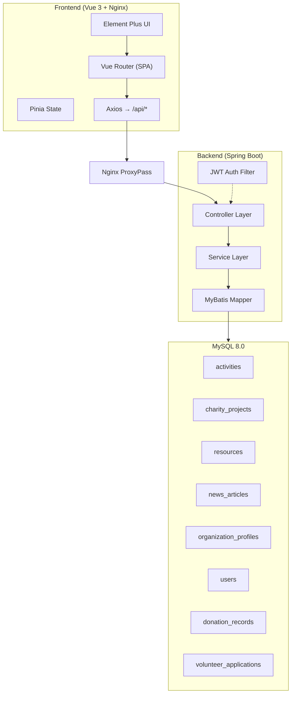

# 爱心公益平台 (Charity Platform)

[](https://github.com/your-username/your-repo/actions/workflows/ci.yml)

一个功能完整的公益慈善平台，提供志愿活动管理、公益项目捐款、资源需求对接、组织认证审核等核心功能。前后端分离架构，支持 Docker 一键部署。

---

## 技术栈

| 层级 | 技术 | 版本 |
|------|------|------|
| 前端框架 | Vue 3 (Composition API + `<script setup>`) | 3.5+ |
| 构建工具 | Vite | 7.x |
| UI 库 | Element Plus | 2.x |
| 样式方案 | Tailwind CSS 4 + Font Awesome 6 | - |
| 状态管理 | Pinia | 3.x |
| 路由 | Vue Router | 4.x |
| HTTP | Axios | 1.x |
| 动画 | AOS (Animate on Scroll) | 2.x |
| 类型检查 | TypeScript + vue-tsc | 5.x / 3.x |
| **后端框架** | Spring Boot | 3.3.x |
| **ORM** | MyBatis（注解模式） | 3.x |
| **分页** | PageHelper | 2.x |
| **安全** | Spring Security + JWT (jjwt) | 0.12.x |
| **数据库** | MySQL | 8.x |
| **部署** | Docker / docker-compose | - |

---

## 功能模块

- **用户系统** - 注册 / 登录 / 角色体系（普通用户 / 志愿者 / 公益组织 / 管理员）
- **志愿活动** - 活动发布、浏览、报名、审核（支持状态流转：草稿→招募中→进行中→已结束）
- **公益项目** - 项目发布、目标金额 / 已筹金额追踪、在线捐款
- **资源需求** - 资源发布、志愿者认领、审核对接
- **公益资讯** - 图文资讯发布、分类展示
- **公益组织** - 组织入驻、资料维护、资质认证审核
- **志愿者管理** - 志愿者申请、资格审核
- **管理后台** - 活动 / 项目 / 资源 / 资讯 / 志愿者 / 组织 全模块审核管理

---

## 架构概览



---

## 快速启动（Docker）

确保已安装 Docker 和 docker-compose，然后执行：

```bash
# 克隆仓库
git clone <your-repo-url>
cd 公益慈善系统

# 一键启动（MySQL + 后端 + 前端）
docker compose up -d --build
```

- 前端页面：http://localhost
- 后端 API：http://localhost:8080/api
- 管理员账号：`admin` / `admin123456`（首次启动自动创建）

> MySQL 端口映射为 `3307`，避免与本地数据库冲突。如需修改，编辑 `docker-compose.yml` 中的 ports 配置。

### 环境变量

| 变量名 | 默认值 | 说明 |
|--------|--------|------|
| `MYSQL_ROOT_PASSWORD` | `123456` | MySQL root 密码 |
| `JWT_SECRET` | `please-change-this-to-a-random-secret-in-production` | JWT 签名密钥（生产环境必须修改） |

---

## 本地开发

### 前置条件

- JDK 17+
- Maven 3.8+
- Node.js 20+
- MySQL 8.x

### 1. 创建数据库

```sql
CREATE DATABASE IF NOT EXISTS gongyi_platform DEFAULT CHARACTER SET utf8mb4;
```

### 2. 启动后端

```bash
cd backend
mvn spring-boot:run
# API 监听 http://localhost:8080
```

> 首次启动会自动创建 admin 账号（`admin` / `admin123456`）。可在 `application.yml` 中关闭此功能。

### 3. 启动前端

```bash
cd frontend
npm install
npm run dev
# 页面打开 http://localhost:5173
# dev 模式下 Vite 自动将 /api 请求代理到后端 8080 端口
```

---

## 项目结构

```
公益慈善系统/
├── backend/                    # Spring Boot 后端
│   ├── src/main/java/.../
│   │   ├── common/             #  统一响应体、全局异常处理
│   │   ├── config/             #  Spring Security、CORS、Admin 初始化
│   │   ├── controller/         #  REST 控制器（8 个）
│   │   ├── domain/
│   │   │   ├── entity/         #  数据库实体
│   │   │   └── enums/          #  枚举（状态、角色等）
│   │   ├── dto/                #  请求 / 响应 DTO
│   │   ├── mapper/             #  MyBatis Mapper 接口（注解 SQL）
│   │   ├── security/           #  JWT 工具、过滤器、UserDetails
│   │   └── service/            #  业务逻辑接口 + 实现
│   ├── Dockerfile
│   └── pom.xml
├── frontend/                   # Vue 3 前端
│   ├── src/
│   │   ├── api/                #  API 调用封装（9 个模块）
│   │   ├── router/             #  路由配置 + 守卫
│   │   ├── stores/             #  Pinia 状态管理
│   │   ├── utils/              #  Axios 实例 + 拦截器
│   │   ├── views/              #  页面组件
│   │   ├── App.vue             #  根组件（导航栏 + 页脚）
│   │   ├── main.ts             #  入口
│   │   └── style.css           #  全局样式
│   ├── Dockerfile
│   └── nginx.conf
├── docker-compose.yml          #  一键部署编排
├── .github/workflows/ci.yml    #  CI 流水线
└── README.md
```

---

## API 概览

| 模块 | 端点 | 说明 |
|------|------|------|
| Auth | `POST /api/auth/register` `POST /api/auth/login` | 注册 / 登录 |
| Activities | `GET/POST/PUT /api/activities/**` | 活动 CRUD、报名、审核 |
| Projects | `GET/POST/PUT/DELETE /api/projects/**` | 项目 CRUD、捐款 |
| Resources | `GET/POST/PUT /api/resources/**` | 资源发布、认领 |
| News | `GET/POST/PUT/DELETE /api/news/**` | 资讯 CRUD |
| Organizations | `GET/POST/PUT /api/organizations/**` | 组织信息、认证 |
| Users | `GET/PUT /api/users/**` | 用户信息 |
| Donations | `GET /api/donations/my` | 捐款记录查询 |
| Volunteers | `POST/PUT/GET /api/volunteer-applications/**` | 志愿者申请、审核 |

> 详情可部署后访问 Swagger / SpringDoc 文档（如已集成）。

---

## License

MIT
